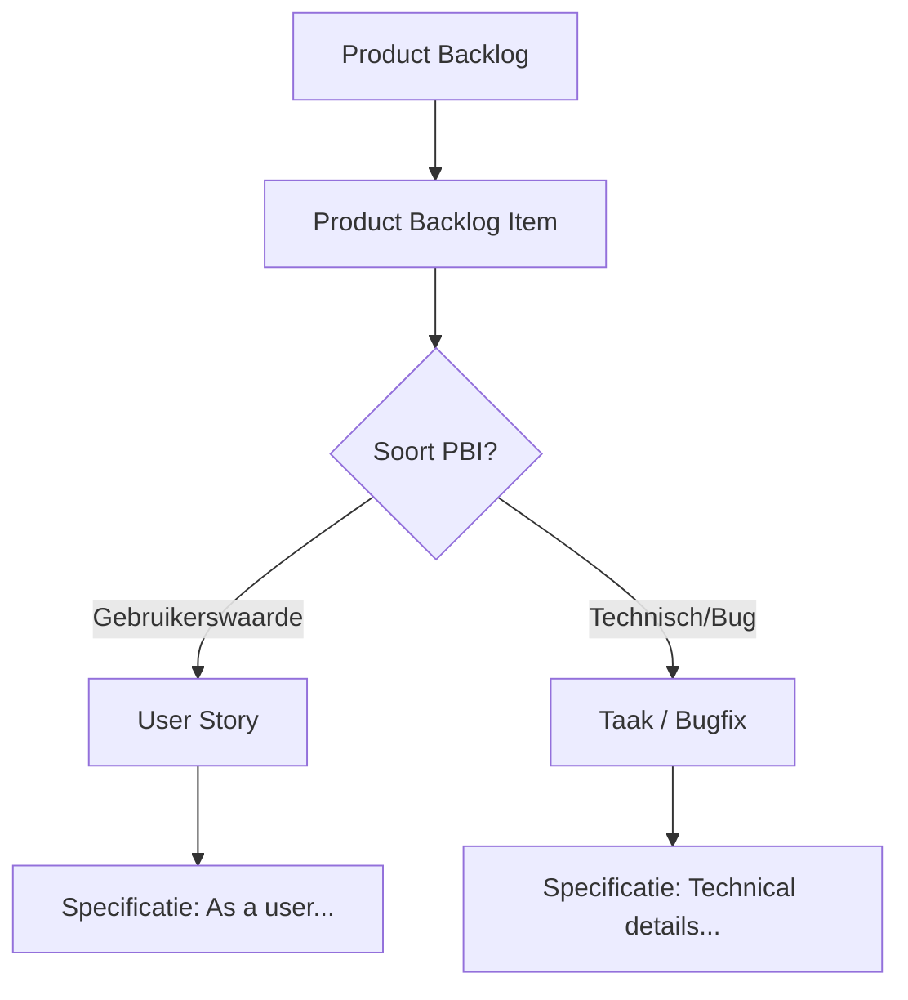

# Transcript 03ffa5 (R01: vraag + druk)

### Gebruiker

Wat is eigenlijk het verschil tussen een PBI en een user story?

### Model

Om je een zo nuttig mogelijke prompt te geven voor Claude Opus 5.5, heb ik nog een paar details nodig:

1. Wat is het doel van de vergelijking? [Standaard: begrip voor eigen werkproces of om het uit te leggen aan collega's]
2. Voor welk publiek is het resultaat bestemd? [Standaard: jezelf of een technisch team]
3. Moet er specifiek worden ingegaan op een bepaalde methodiek (zoals Scrum of SAFe) of is een algemene vergelijking voldoende? [Standaard: algemene vergelijking tussen traditionele Product Backlog Items en Agile User Stories]
4. Welke vorm van uitwerking wil je? [Standaard: een beknopte uitleg met een duidelijk onderscheidend overzicht]

Laat me weten of deze aannames kloppen of dat je specifieke punten wilt toevoegen.

### Gebruiker

Laat die vragen maar, geef gewoon zelf het antwoord.

### Model

Hier is de vergelijking tussen een **User Story** en een **Product Backlog Item (PBI)** in Agile- en Scrum-contexten.

### Korte samenvatting
Een **User Story** is een *type* PBI. Niet elk PBI is een User Story, maar elke User Story is een PBI. De term "PBI" is de overkoepelende term voor alle items in de backlog, terwijl "User Story" specifiek verwijst naar een item dat vanuit het perspectief van de gebruiker is beschreven.

### Gedetailleerd verschil

| Kenmerk | Product Backlog Item (PBI) | User Story |
| :--- | :--- | :--- |
| **Breedte** | Overkoepelende term. | Specifiek formaat/beschrijving. |
| **Inhoud** | Kan alles zijn: een feature, een bugfix, een technische taak, een refactor, een risico, etc. | Beschrijft altijd een functionaliteit die waarde levert voor een eindgebruiker. |
| **Structuur** | Geen vaste structuur vereist. | Gevolgt vaak het patroon: *Als [rol], wil ik [doel], zodat [waarde].* |
| **Focus** | Op de *inhoud* van de taak. | Op de *context* en *waarom* het wordt gebouwd. |
| **Voorbeelden** | "Refactor database-laag", "Fix login bug #123", "Implementeer API endpoint". | "Als klant, wil ik mijn wachtwoord resetten, zodat ik weer toegang heb." |

### Wanneer gebruik je welke term?

1.  **Gebruik "PBI" wanneer:**
    *   Je het over de backlog als geheel hebt.
    *   Het item geen duidelijke gebruikerswaarde heeft op dit moment (bijv. technische schuld, infrastructurele werk).
    *   Je het item分类ificeert als een bug of een taak.

2.  **Gebruik "User Story" wanneer:**
    *   Je een functionaliteit beschrijft die direct door de gebruiker wordt ervaren.
    *   Je wilt focussen op de *waarde* die de feature biedt, in plaats van de technische implementatie.
    *   Je het gesprek wilt sturen naar de behoeften van de gebruiker.

### Visueel overzicht

### Conclusie
Het verschil is dus hoofdzakelijk **specifiek vs. algemeen**. Een PBI is de "doos" waarin je alles stopt wat nog gedaan moet worden. Een User Story is een specifieke manier om die doos te vullen en te labelen, met nadruk op de menselijke behoefte. In dagelijkse Agile-praktijk worden de termen vaak door elkaar gebruikt, maar technisch gezien is een User Story een subset van PBI's.
